# 📄 Smart Document/Screen OCR Pipeline

A modular, **strategy-pattern-based OCR pipeline** built for a specific, unglamorous real-world problem: reliably extracting text from a **paper or a monitor/laptop screen filmed by a live webcam** (or a still photo) — while automatically finding the screen, straightening its perspective, and refusing to read a frame if a **person is obstructing the view**.

Every stage of the pipeline (obstacle detection, corner detection, rectification, text detection, text recognition) is an interchangeable strategy, so you can trade speed for accuracy per stage without touching the pipeline logic.

> Full CLI reference and ready-made command combos: **[`project-run.md`](project-run.md)** (in Persian).

---

## Table of Contents

- [📄 Smart Document/Screen OCR Pipeline](#-smart-documentscreen-ocr-pipeline)
  - [Table of Contents](#table-of-contents)
  - [Why this exists](#why-this-exists)
  - [Pipeline architecture](#pipeline-architecture)
  - [Key features](#key-features)
  - [Supported models per stage](#supported-models-per-stage)
  - [Parallel processing](#parallel-processing)
  - [Installation](#installation)
  - [Quick start](#quick-start)
  - [Demo / Test results](#demo--test-results)
    - [Test 1](#test-1)
    - [Test 2](#test-2)
  - [Obstacle detection test](#obstacle-detection-test)
  - [Project structure](#project-structure)
  - [How it compares to well-known OCR repos](#how-it-compares-to-well-known-ocr-repos)
  - [Acknowledgements](#acknowledgements)
  - [Author](#author)
  - [License](#license)

---

## Why this exists

Most OCR libraries assume you already have a clean, cropped, upright image of text. In practice — scanning a document or a monitor with a phone/webcam — you don't:

- The paper or screen occupies only part of the frame, at an angle.
- Someone's hand, head, or body can block part of it mid-capture.
- The result needs to be readable at "good enough for production" quality without a flatbed scanner.

This project chains together several state-of-the-art, pretrained models (no custom training required) into a single pipeline that handles the *whole* problem end to end: **locate → verify unobstructed → align → flatten → detect text → recognize text → group into lines.**

## Pipeline architecture

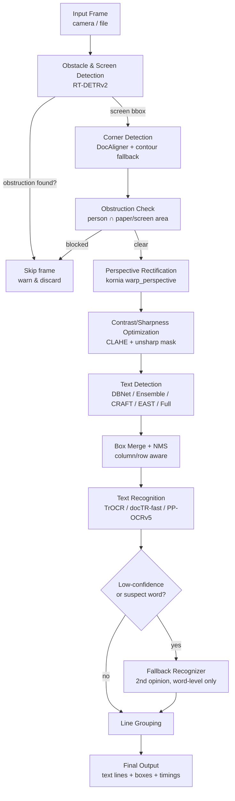

Two independent detectors run every frame *before* any OCR happens:

1. **Screen/Obstacle detector (RT-DETRv2)** — finds a coarse `laptop`/`tvmonitor` bounding box to crop into (faster + more accurate corner detection), and separately flags `person` detections.
2. **Corner detector (DocAligner)** — a heatmap-regression model that returns the 4 true corners of the document/screen inside that crop, with a classical contour-based fallback if the model is unsure.

Only if the frame is corner-detected **and** not obstructed does it proceed to rectification and OCR — this avoids wasting compute (and producing garbage output) on frames that are unusable anyway.

Independently of this per-frame gating, several stages can also be scaled *horizontally* rather than just swapped for a different backend: multi-model detector combos, in-process GPU model replicas, and the PP-OCRv5 microservice can all run several model instances concurrently on the same image (or across images) — see [Parallel processing](#parallel-processing) below.

## Key features

- 🧩 **Strategy pattern everywhere** — every pipeline stage is an abstract interface (`strategies/base.py`); swapping a model is a one-line change, no pipeline surgery.
- 🚧 **Built-in obstruction guard** — a frame where a person is covering the paper/screen is automatically discarded instead of producing corrupted OCR output.
- 📐 **Automatic corner detection + dynamic perspective rectification** — output resolution scales to the document's real aspect ratio (up to a configurable max dimension), it isn't forced into a fixed square.
- 🔀 **5 text-detection backends** (single-model, 3-model ensemble, CRAFT, EAST, or all combined) and **3 text-recognition backends** (TrOCR, docTR-based lightweight recognizers, PaddleOCR PP-OCRv5) — pick per use case.
- 🥈 **Optional fallback recognizer** — a second model re-reads only the low-confidence/geometrically-suspect words instead of the whole image, for a controlled accuracy/speed trade-off.
- 🌡️ **Adaptive inference resolution** (optional) — auto-tunes detector input size against a real-time budget for camera mode.
- 🧠 **Smart word→line grouping** — column-aware, y-band clustering groups words into reading-order lines instead of naive top-to-bottom sorting.
- 🖥️ **Live camera or static file mode**, with full step-by-step debug image export (`--debug`).
- 🔌 **Isolated PP-OCRv5 microservice** — PaddleOCR runs in its own process/conda env over a tiny Flask API, so it never conflicts with the main PyTorch stack's dependencies.
- 📦 **Folder / batch mode** (`--mode folder`) — processes an entire directory of images end to end, decoding/prefetching the next file on CPU while the GPU is busy with the current one, and writes one `.txt` result per input image.
- 🚀 **Multi-level parallel processing** — three independent, stackable levels of parallelism: across images in folder mode (`--workers`), across the text boxes of a single image via in-process GPU model replicas on separate CUDA streams (`--recognizer-replicas`), and across PP-OCRv5 microservice ports/replicas (`--ppocr-server-urls` + `PPOCR_NUM_REPLICAS`). See [Parallel processing](#parallel-processing).
- ⚙️ **Everything CLI-tunable** — backbone, detector, recognizer, beam count, fp16, debug, log level, real-time budget, parallelism level, etc. See [`project-run.md`](project-run.md).

## Supported models per stage

| Stage | Backend(s) |
|---|---|
| Screen/obstacle detection | RT-DETRv2 (`r18vd` / `r34vd` / `r50vd` / `r101vd`) |
| Corner detection | DocAligner (heatmap regression) + OpenCV contour fallback |
| Rectification | Perspective warp (`kornia`) with dynamic output sizing |
| Text detection | docTR DBNet · docTR 3-model ensemble · CRAFT · EAST · all combined |
| Text recognition | TrOCR (small/base/large) · docTR fast (PARSeq/MASTER/CRNN×3/ViTSTR) · PaddleOCR PP-OCRv5 |

## Parallel processing

Beyond picking multi-model detector/recognizer backends, the pipeline supports **three independent, stackable levels** of parallel execution. Each lives in a different place and they can be combined freely:

| Level | What runs in parallel | How to enable | Where it runs |
|---|---|---|---|
| 1. Across images | Decoding/prefetching the next image on CPU, overlapped with GPU inference on the current one | `--mode folder --workers N` | `main.py` (main process + CPU worker pool) |
| 2. Within one image, across text boxes (local models) | The word boxes detected in a single image are split across N replicas of the recognition model (`trocr` / `fast`), each dispatched on its own CUDA stream | `--recognizer-replicas N` (+ `--recognizer-batch-size`) | `main.py`, same process, same GPU |
| 3. Within one image, across PP-OCRv5 ports/replicas | Word boxes are split across multiple PP-OCRv5 microservice ports, and each port can additionally hold several internal model replicas of its own | `--ppocr-server-urls` (client side) + `PPOCR_NUM_REPLICAS` / `PPOCR_DEVICES` (server side) | One or more separate `ppocr_server.py` processes |

A related but distinct form of parallelism, already mentioned under [Key features](#key-features) and [Supported models per stage](#supported-models-per-stage): the `ensemble`/`full` text-detection backends run their *underlying detector models* concurrently (also via separate CUDA streams, using the shared thread pool in `parallel_utils.py`) on the same input image and merge the results with IoU. That's "multiple different models on one input", as opposed to the "one model replicated across boxes" parallelism described in the table above.

**Level 1 — across images:**

```bash
python main.py --mode folder --input-dir path/to/images --output-dir ocr_results --workers 4
```

**Level 2 — in-process GPU replicas for `trocr` / `fast`:**

```bash
python main.py --mode file --file dense_page.jpg --detector ensemble \
    --recognizer fast --fast-arch parseq --recognizer-replicas 4 --recognizer-batch-size 16
```

Instead of a single copy of the recognition model, 4 fully independent copies are loaded; the boxes detected in the image are split roughly evenly between them and processed concurrently, each on its own CUDA stream, then merged back in the original word order.

> ⚠️ **GPU memory:** each replica loads its own full copy of the model weights, so VRAM usage scales roughly linearly with `--recognizer-replicas`. 2–4 replicas per GPU is usually the sweet spot — beyond that you're mostly spending memory rather than gaining throughput, especially if a typical image only has a few dozen text boxes.

**Level 3 — PP-OCRv5, two layers deep (multiple ports × replicas per port):**

```bash
# Terminal 1 — port 5005, 2 replicas on the default GPU
PPOCR_PORT=5005 PPOCR_NUM_REPLICAS=2 python ppocr_server.py

# Terminal 2 — port 5006, 2 replicas each pinned to gpu:1
PPOCR_PORT=5006 PPOCR_NUM_REPLICAS=2 PPOCR_DEVICES=gpu:1,gpu:1 python ppocr_server.py

python main.py --mode file --file dense_page.jpg --detector ensemble --recognizer ppocrv5 \
    --ppocr-server-urls http://127.0.0.1:5005,http://127.0.0.1:5006
```

Total parallel PP-OCRv5 workers = (number of ports in `--ppocr-server-urls`) × (`PPOCR_NUM_REPLICAS` per port). The per-port replicas run as threads inside the same Flask/waitress process — since PaddleOCR inference happens outside the Python GIL, they run genuinely concurrently.

All three levels can be combined at once, e.g. `--mode folder --workers 4` (across images) together with two PP-OCRv5 ports that each run two internal replicas (within each image).

> For the complete argument reference, all PP-OCRv5 environment variables, and more ready-made command presets, see **[`project-run.md`](project-run.md#پردازش-موازی-parallel-processing)**.

## Installation

```bash
git clone <this-repo>
cd <this-repo>
pip install -r requirements.txt
```

> ⚠️ **Do not** install `paddlepaddle` / `paddleocr` in this environment — they conflict with `torch`/`opencv`/`huggingface-hub` here. PP-OCRv5 support runs as an isolated microservice; see [`project-run.md`](project-run.md#راه‌اندازی-میکروسرویس-pp-ocrv5) for the two-environment setup. Each `ppocr_server.py` process can additionally host multiple internal model replicas via `PPOCR_NUM_REPLICAS`/`PPOCR_DEVICES` (see [Parallel processing](#parallel-processing)) — that's controlled purely by environment variables, no extra install step needed.

For `--detector east` you additionally need to download `frozen_east_text_detection.pb` manually (not distributed as a Python package) and place it next to `main.py`.

## Quick start

```bash
# Process a single image
python main.py --mode file --file sample.jpg

# Live webcam — press 's' to scan, 'q' to quit
python main.py --mode camera

# Best accuracy/speed balance (needs the PP-OCRv5 microservice running)
python main.py --mode file --file sample.jpg --detector dbnet --recognizer ppocrv5

# Save every intermediate debug image
python main.py --mode file --file sample.jpg --debug

# Batch-process a whole folder (CPU decode/prefetch overlapped with GPU inference)
python main.py --mode folder --input-dir path/to/images --output-dir ocr_results --workers 4

# Same image, recognition split across 3 in-process GPU model replicas
python main.py --mode file --file sample.jpg --detector ensemble --recognizer fast --recognizer-replicas 3
```

See **[`project-run.md`](project-run.md)** for the complete argument reference and more ready-made command presets (lightweight/CPU mode, max-accuracy mode, full ensemble mode, etc.), and [Parallel processing](#parallel-processing) above for what `--workers`/`--recognizer-replicas`/multi-port PP-OCRv5 do and how to combine them.

## Demo / Test results

Each test below was run with `--debug`, which saves every intermediate step to disk. The 6 images per test are, in order: the **original input**, and the **5 debug images the pipeline generates on its own** (`debug_corner_model_input.jpg`, `step1_corners_detected.jpg`, `step1_flattened.jpg`, `step3_text_boxes.jpg`, `step4_reconstructed.jpg`). Both tests below reached **100% recognition accuracy** against the ground-truth text in the source image.

<!--
Replace the placeholders below with your own images/log, e.g. under assets/test1/, assets/test2/.
-->

### Test 1

| Input | Corner Model Input | Corners Detected |
|:---:|:---:|:---:|
|  | 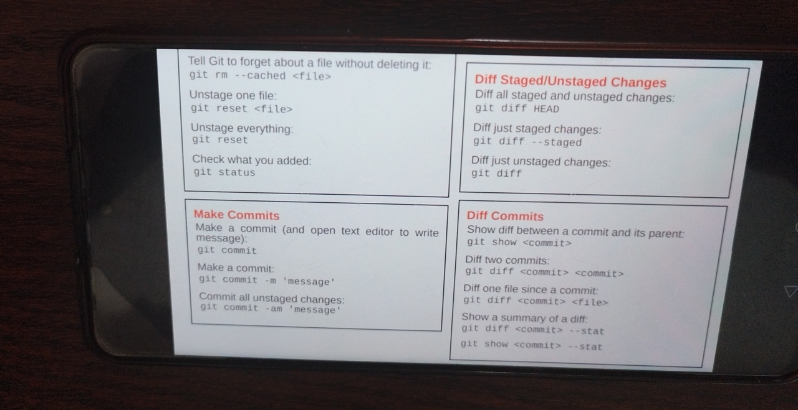 | 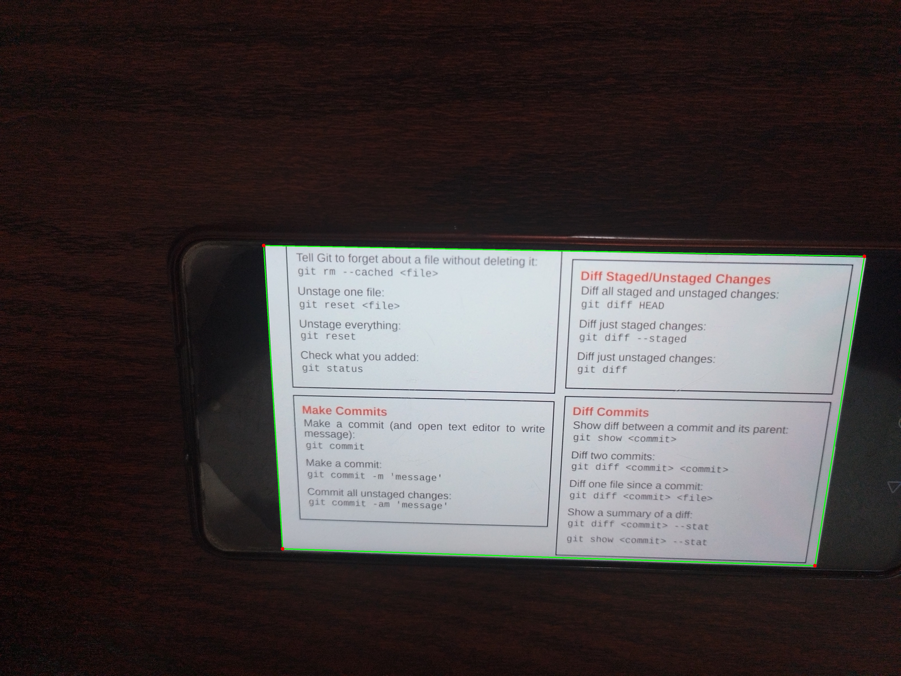 |

| Flattened / Rectified | Text Boxes | Reconstructed Text |
|:---:|:---:|:---:|
| 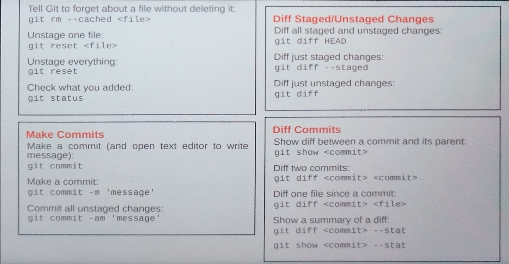 | 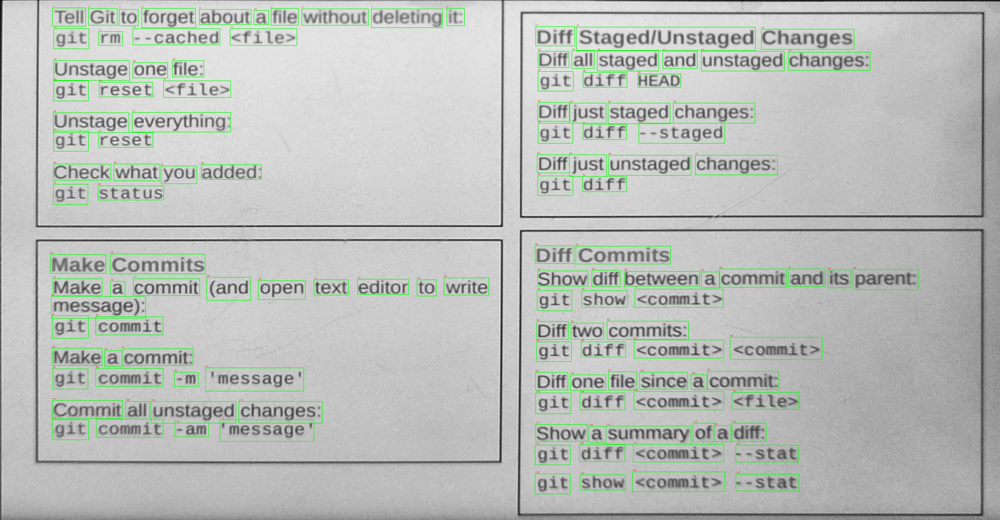 | 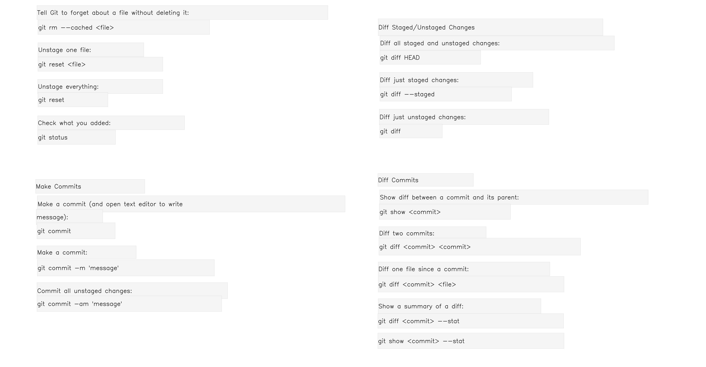 |

<details>
<summary><b>Run log (timings, model info, accuracy)</b></summary>

```text
2026-08-10 21:54:10,593 INFO pipeline: --- Pipeline Time Summary ---
2026-08-10 21:54:10,594 INFO pipeline: ------------------------------------------------------------
2026-08-10 21:54:10,594 INFO pipeline: [TIME] Total model+algorithm time: 1.68s (budget: 2.50s)
2026-08-10 21:54:10,594 INFO pipeline:   - Screen/Obstacle Detection [RT-DETRv2 (PekingU/rtdetr_v2_r18vd)]: 0.34s
2026-08-10 21:54:10,594 INFO pipeline:   - Corner Detection          [DocAligner (heatmap-regression corner detector)]: 0.04s
2026-08-10 21:54:10,594 INFO pipeline:   - Image Optimization        [CLAHE algorithm]: 0.31s
2026-08-10 21:54:10,594 INFO pipeline:   - Rectification             [Perspective Warp (kornia get_perspective_transform + warp_perspective)]: 0.34s
2026-08-10 21:54:10,594 INFO pipeline:   - Text Detection            [docTR DBNet (db_resnet50)]: 0.23s
2026-08-10 21:54:10,594 INFO pipeline:   - Box Merging               [smart_merge_boxes algorithm]: 0.00s
2026-08-10 21:54:10,594 INFO pipeline:   - Text Recognition          [docTR fast recognizer (parseq)]: 0.41s (128 words)
2026-08-10 21:54:10,594 INFO pipeline: ------------------------------------------------------------

[RESULT] Extracted Texts (Line by Line):
Line 1 (10 words): Tell Git to forget about a file without deleting it:
Line 2 (4 words): git rm --cached <file>
Line 3 (3 words): Unstage one file:
Line 4 (3 words): git reset <file>
Line 5 (2 words): Unstage everything:
Line 6 (2 words): git reset
Line 7 (4 words): Check what you added:
Line 8 (2 words): git status
Line 9 (2 words): Make Commits
Line 10 (9 words): Make a commit (and open text editor to write
Line 11 (1 words): message):
Line 12 (2 words): git commit
Line 13 (3 words): Make a commit:
Line 14 (4 words): git commit -m 'message'
Line 15 (4 words): Commit all unstaged changes:
Line 16 (4 words): git commit -am 'message'
Line 17 (3 words): Diff Staged/Unstaged Changes
Line 18 (6 words): Diff all staged and unstaged changes:
Line 19 (3 words): git diff HEAD
Line 20 (4 words): Diff just staged changes:
Line 21 (3 words): git diff --staged
Line 22 (4 words): Diff just unstaged changes:
Line 23 (2 words): git diff
Line 24 (2 words): Diff Commits
Line 25 (8 words): Show diff between a commit and its parent:
Line 26 (3 words): git show <commit>
Line 27 (3 words): Diff two commits:
Line 28 (4 words): git diff <commit> <commit>
Line 29 (6 words): Diff one file since a commit:
Line 30 (4 words): git diff <commit> <file>
Line 31 (6 words): Show a summary of a diff:
Line 32 (4 words): git diff <commit> --stat
Line 33 (4 words): git show <commit> --stat
```

</details>

### Test 2

| Input | Corner Model Input | Corners Detected |
|:---:|:---:|:---:|
|  | 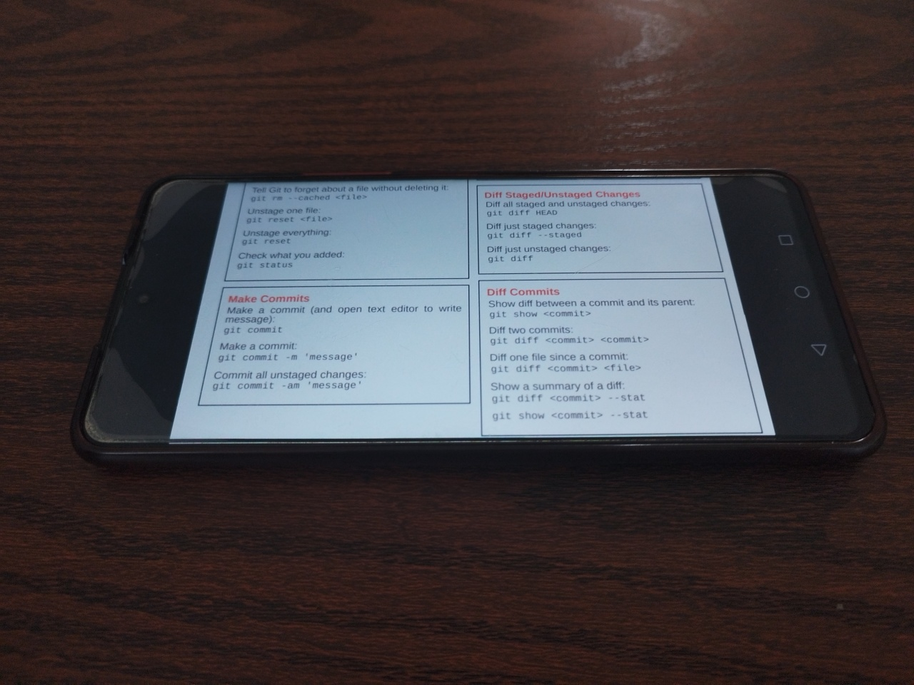 | 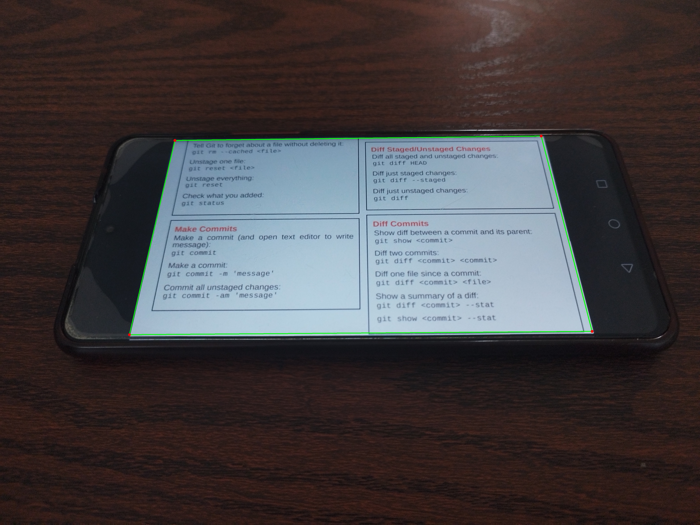 |

| Flattened / Rectified | Text Boxes | Reconstructed Text |
|:---:|:---:|:---:|
| 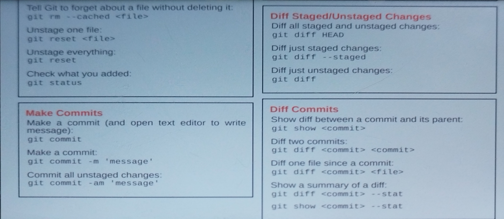 | 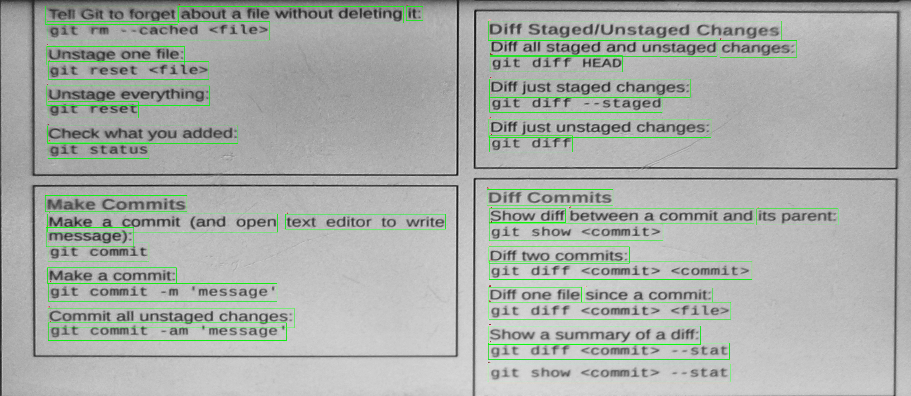 | 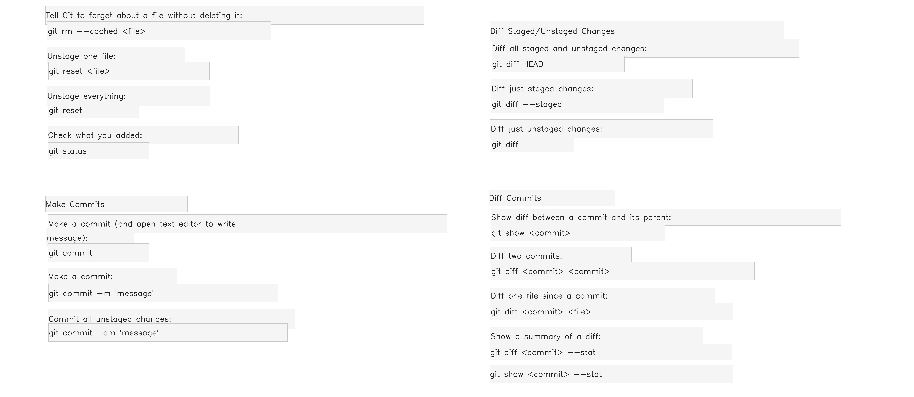 |

<details>
<summary><b>Run log (timings, model info, accuracy)</b></summary>

```text
2026-08-10 21:06:19,426 INFO pipeline: --- Pipeline Time Summary ---
2026-08-10 21:06:19,426 INFO pipeline: ------------------------------------------------------------
2026-08-10 21:06:19,426 INFO pipeline: [TIME] Total model+algorithm time: 1.69s (budget: 2.50s)
2026-08-10 21:06:19,426 INFO pipeline:   - Screen/Obstacle Detection [RT-DETRv2 (PekingU/rtdetr_v2_r18vd)]: 0.37s
2026-08-10 21:06:19,426 INFO pipeline:   - Corner Detection          [DocAligner (heatmap-regression corner detector)]: 0.06s
2026-08-10 21:06:19,426 INFO pipeline:   - Image Optimization        [CLAHE algorithm]: 0.32s
2026-08-10 21:06:19,426 INFO pipeline:   - Rectification             [Perspective Warp (kornia get_perspective_transform + warp_perspective)]: 0.38s
2026-08-10 21:06:19,426 INFO pipeline:   - Text Detection            [docTR DBNet (db_resnet50)]: 0.22s
2026-08-10 21:06:19,427 INFO pipeline:   - Box Merging               [smart_merge_boxes algorithm]: 0.00s
2026-08-10 21:06:19,427 INFO pipeline:   - Text Recognition          [PP-OCRv5 remote microservice (PP-OCRv5_server_rec, device=gpu:0)]: 0.35s (40 words)
2026-08-10 21:06:19,427 INFO pipeline: ------------------------------------------------------------

[RESULT] Extracted Texts (Line by Line):
Line 1 (3 words): Tell Git to forget about a file without deleting it:
Line 2 (1 words): git rm --cached <file>
Line 3 (1 words): Unstage one file:
Line 4 (1 words): git reset <file>
Line 5 (1 words): Unstage everything:
Line 6 (1 words): git reset
Line 7 (1 words): Check what you added:
Line 8 (1 words): git status
Line 9 (1 words): Make Commits
Line 10 (2 words): Make a commit (and open text editor to write
Line 11 (1 words): message):
Line 12 (1 words): git commit
Line 13 (1 words): Make a commit:
Line 14 (1 words): git commit -m 'message'
Line 15 (1 words): Commit all unstaged changes:
Line 16 (1 words): git commit -am 'message'
Line 17 (1 words): Diff Staged/Unstaged Changes
Line 18 (2 words): Diff all staged and unstaged changes:
Line 19 (1 words): git diff HEAD
Line 20 (1 words): Diff just staged changes:
Line 21 (1 words): git diff --staged
Line 22 (1 words): Diff just unstaged changes:
Line 23 (1 words): git diff
Line 24 (1 words): Diff Commits
Line 25 (3 words): Show diff between a commit and its parent:
Line 26 (1 words): git show <commit>
Line 27 (1 words): Diff two commits:
Line 28 (1 words): git diff <commit> <commit>
Line 29 (2 words): Diff one file since a commit:
Line 30 (1 words): git diff <commit> <file>
Line 31 (1 words): Show a summary of a diff:
Line 32 (1 words): git diff <commit> --stat
Line 33 (1 words): git show <commit> --stat
```

</details>

> The pipeline's speed/accuracy trade-off is fully tunable — see [`project-run.md`](project-run.md) for the "max accuracy" and "pure real-time" command presets and their expected timing ranges.

## Obstacle detection test

Demonstrates the pipeline correctly **refusing** to OCR a frame because a person is blocking the paper/screen — the frame is discarded instead of producing corrupted text output.

| Input (person blocking the screen) | Obstruction Debug Output |
|:---:|:---:|
|  |  |

<details>
<summary><b>Console output</b></summary>

```text
```

</details>

## Project structure

```
.
├── main.py                        # CLI entry point, wires strategies into the pipeline
├── pipeline.py                    # OCRPipeline orchestration + box/line merging algorithms
├── parallel_utils.py              # Shared thread pool, CUDA stream pool, chunk-splitting helpers (used by all parallel-processing levels)
├── strategies/
│   ├── base.py                    # Abstract strategy interfaces (Strategy pattern)
│   ├── obstacle.py                # RT-DETRv2 screen + obstacle detector
│   ├── corner_detection.py        # DocAligner corner detector + contour fallback
│   ├── rectification.py           # kornia-based dynamic perspective warp
│   ├── input_source.py            # File / live camera input
│   ├── text_detection.py          # DBNet / ensemble / CRAFT / EAST / full (stream-parallel ensembles)
│   ├── text_recognition.py        # TrOCR
│   ├── text_recognition_fast.py   # docTR lightweight recognizers
│   ├── text_recognition_parallel.py # Wraps N recognizer replicas across CUDA streams (--recognizer-replicas)
│   └── text_recognition_ppocr.py  # PP-OCRv5 client (talks to one or more microservice ports)
├── ppocr_service/
│   ├── ppocr_server.py            # Isolated Flask microservice for PaddleOCR (supports internal replicas via PPOCR_NUM_REPLICAS)
│   ├── ppocr.bat                  # Windows one-click launcher
│   └── requirements.txt           # paddlepaddle / paddleocr — separate env only
├── requirements.txt                # Main (torch) environment
└── project-run.md                  # Full CLI reference (Persian)
```

## How it compares to well-known OCR repos

Being transparent about this: this project is **not a competitor to general-purpose OCR engines**, and it actually *uses* some of them (docTR, PaddleOCR) internally as pluggable recognizers. It doesn't have their scale, language coverage, or years of production hardening. It solves a narrower, more specific problem well — turning a live camera feed of a physical document/screen into clean text — which those libraries leave entirely to the caller.

| | This project | Tesseract | EasyOCR | PaddleOCR | docTR |
|---|:---:|:---:|:---:|:---:|:---:|
| Scope | End-to-end capture pipeline | OCR engine | OCR engine | OCR engine + tools | OCR engine |
| Auto screen/document localization | ✅ | ❌ | ❌ | ❌ | ❌ |
| Perspective auto-rectification | ✅ | ❌ | ❌ | ❌ | ❌ |
| Live-obstruction detection (person blocking view) | ✅ | ❌ | ❌ | ❌ | ❌ |
| Multi-backend detector/recognizer swapping | ✅ (5 detectors / 3 recognizers) | ❌ | Limited | Limited | Multiple archs |
| Confidence-based fallback re-reading | ✅ | ❌ | ❌ | ❌ | ❌ |
| Multi-level parallelism built into the tool itself (image / in-image replica / microservice) | ✅ (3 stackable levels, see [Parallel processing](#parallel-processing)) | External tooling only | External tooling only | Provided by external serving frameworks | External tooling only |
| Language coverage | English-restricted by design | 100+ languages | 80+ languages | 80+ languages | Latin-focused |
| Community size / maturity | New, single-maintainer | ~30 years, huge | Large, mature | Very large, mature | Solid, mature |

**Bottom line:** on raw text-recognition accuracy or language breadth, mature engines like PaddleOCR, Tesseract, or EasyOCR — each backed by large teams/communities and years of edge-case hardening — are the safer choice, and are far more battle-tested than a single-maintainer project. What this repository demonstrates well is *pipeline engineering*: composing multiple pretrained models (detection, alignment, rectification, ensembling, fallback recognition) into one coherent, configurable system for a specific real-world capture scenario that those general-purpose libraries don't address out of the box. Whether it's "better" depends entirely on the use case — for "read text from any image in 100+ languages," use an established engine; for "reliably scan a physical document or monitor from a live camera with automatic alignment and obstruction handling," this pipeline is purpose-built for exactly that.

## Acknowledgements

This project builds on top of these excellent open-source models/projects: [RT-DETRv2](https://huggingface.co/PekingU), [DocAligner](https://github.com/DocsaidLab/DocAligner), [docTR](https://github.com/mindee/doctr), [TrOCR](https://huggingface.co/microsoft/trocr-base-printed), [PaddleOCR](https://github.com/PaddlePaddle/PaddleOCR), [CRAFT](https://github.com/clovaai/CRAFT-pytorch), [EAST](https://github.com/argman/EAST), and [Kornia](https://github.com/kornia/kornia).

## Author

**Sobhan Nasiri**

## License

<!-- Add your license of choice, e.g. MIT — see LICENSE file. -->